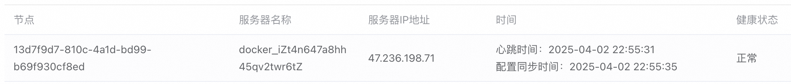
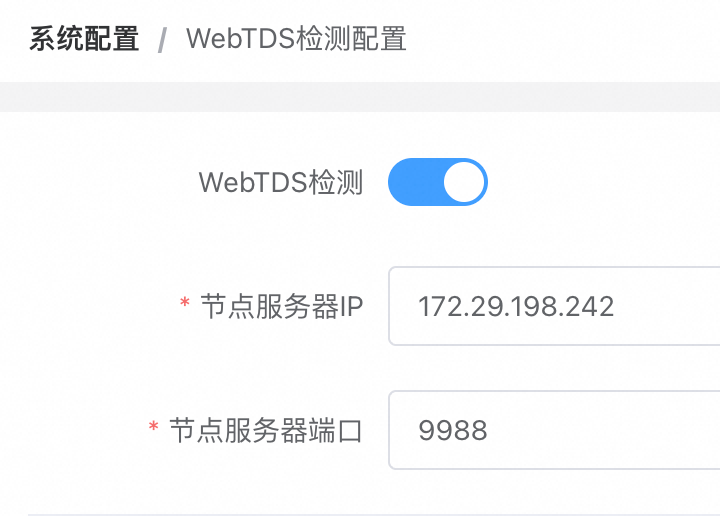
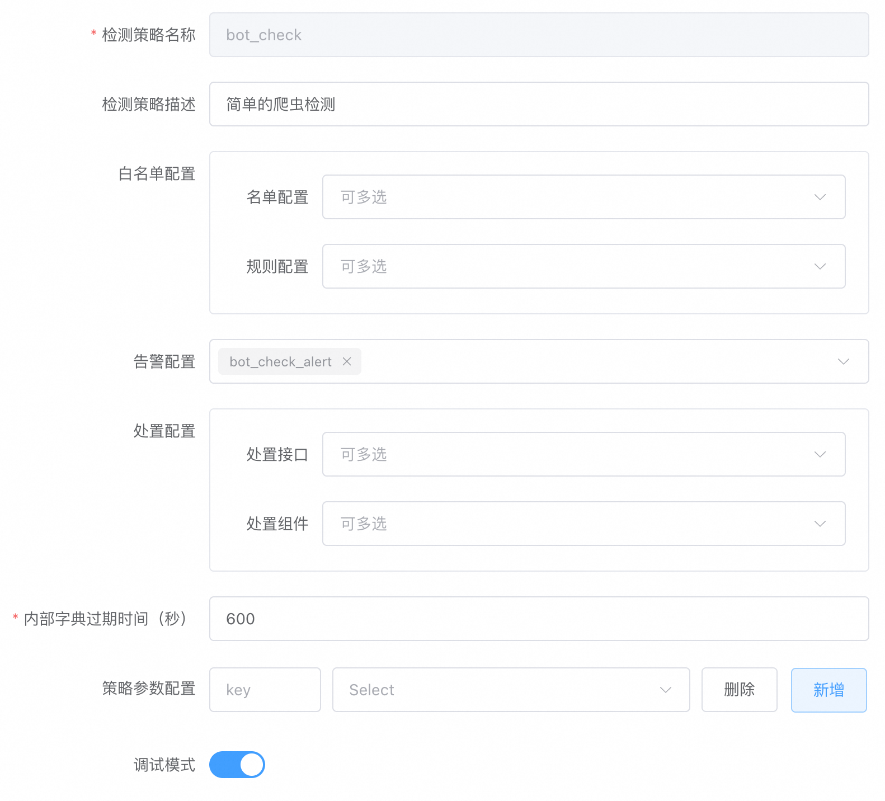

# WebTDS

[中文版](https://github.com/jx-sec/webtds/blob/master/README.md)  
[English](https://github.com/jx-sec/webtds/blob/master/English.md)

## Introduction

**WebTDS** (Web Threat Detection System) is a real-time big data analysis system specifically designed for web security detection scenarios. Built on a self-developed real-time big data analysis engine, it achieves extremely low latency (millisecond-level) for real-time data analysis. Compared to general-purpose stream processing systems (e.g., Flink/Storm), WebTDS is deeply customized and optimized for web security detection scenarios. Users can implement complex security detection logic by configuring detection policies without writing code.

🌟 **High Performance & Low Cost | Visual Configuration | Entity Behavior Analysis | Online Learning**

## Key Features

### High Performance & Low Cost

- **High Performance**: Single node processes over 1 billion events daily, supporting horizontal scaling to handle trillion-level traffic with ease.
- **Low Computing Cost**: Reduces computing costs by over 90% compared to Flink through a self-developed high-performance engine.
- **Low O&M Cost**: No external dependencies (e.g., Hadoop/ZooKeeper), ready to use out-of-the-box.

### Visual Configuration

- **Zero-Code Rule Design**: Configure detection policies (regex matching, list matching, in-memory computation, correlation analysis, etc.) via a graphical console.
- **Real-Time Hot Updates**: Policy changes take effect in seconds without disrupting production.
- **End-to-End Workflow**: Full visual workflow from policy design, testing, to deployment.

### Entity Behavior Analysis

- **Multi-Dimensional Entity Recognition**: Supports dynamic combinations of entities (users, IPs, devices, APIs) for complex scenarios.
- **Anomaly Detection**: Identifies abnormal behaviors (e.g., access frequency, operation sequences, anomalous actions/devices) via dynamic policies. Examples: penetration testing, bot behavior, API abuse.

### Online Learning

**Online Learning** is a machine learning approach where models update incrementally with new data rather than batch training. WebTDS supports training custom security models via online learning, enabling data-driven detection beyond traditional rule-based methods. Key applications:

- Compromised account detection
- Insider data theft detection
- APT attack detection

| **Feature**         | **WebTDS Online Learning**                      | **Traditional Batch Learning**           |  
|---------------------|------------------------------------------------|------------------------------------------|  
| **Data Timeliness** | Real-time data                                 | Historical data                          |  
| **Model Update**    | Instant updates                                | Periodic updates (e.g., daily/weekly)    |  
| **Hardware**        | Low-resource, runs on edge devices/servers     | High-performance clusters required       |  
| **Use Cases**       | Real-time threat detection, internal threats  | Post-analysis, periodic checks           |  

## Documentation

[WebTDS Documentation](https://docs.jxwaf.com/webtds/Product-Introduction.html)

## Features

- **Online Environment**
  - Basic Components
  - List Matching
  - Rule Matching
  - Analysis Components
  - Detection Policies
- **Operations Center**
  - Event Management
  - Behavior Tracking
  - Log Query
  - Node Status
- **Configuration Management**
  - Basic Components
  - List Matching
  - Rule Matching
  - Analysis Components
  - Detection Policies
  - Global Dictionaries
  - Policy Alerts
  - Response APIs
  - Response Components
- **System Management**
  - Basic Info
  - Console Configuration
  - Log Transfer
  - Log Query

## Architecture

WebTDS consists of three subsystems:
- **WebTDS Console**
- **WebTDS Node**
- **WebTDS Log System**

<kbd></kbd>

## Deployment

### Requirements

- OS: Debian 12.x
- Minimum Hardware: 4 CPU cores, 8GB RAM

### WebTDS Console Registration

1. Visit https://webtds.jxwaf.com to register.
2. Enable two-factor authentication (2FA) via **Tencent Authenticator** WeChat mini-app (scan QR on the page).

After login, navigate to **System Management > Basic Info** to obtain `wtds_auth` for node configuration.

<kbd></kbd>

### WebTDS Node Deployment

```bash
# 1. Install Docker
curl -fsSL https://get.docker.com | bash -s docker --mirror Aliyun

# 2. Clone repo (use https://gitclone.com/github.com/jx-sec/jxwaf.git in China)
git clone https://github.com/jx-sec/webtds.git

# 3. Start container
cd webtds/webtds_node
vim docker-compose.yml  # Set WTDS_AUTH to your wtds_auth value
docker compose up -d
```

Check node status under **Operations Center > Node Status**.

<kbd></kbd>

### WebTDS Log Service Deployment

```bash
# 1. Install Docker
curl -fsSL https://get.docker.com | bash -s docker --mirror Aliyun

# 2. Clone repo
git clone https://github.com/jx-sec/webtds.git

# 3. Start container
cd webtds/webtds_jxlog
docker compose up -d
```

Configure log settings in the console:

1. **System Management > Log Transfer Configuration**  
   <kbd></kbd>

2. **System Management > Log Query Configuration**  
   <kbd></kbd>

### Validation

#### Environment

- JXWAF Node:  
  Public IP: 47.120.34.247  
  Private IP: 172.29.198.240  

- WebTDS Node:  
  Public IP: 47.120.67.55  
  Private IP: 172.29.198.242  

#### Enable WebTDS Detection

In JXWAF Console: **System Management > WebTDS Detection Configuration**  
<kbd></kbd>

#### Configure Detection Policy

**Objective**: Simple bot detection  
**Logic**: Trigger alert if an IP accesses >100 distinct HTML pages (HTTP 200) within 10 minutes.

**Policy Configuration**:  
<kbd></kbd>

**Internal Dictionary**:  
<kbd></kbd>

**Policy Rules**:  
1. `ip_diff_html_count`: Track unique HTML page accesses per IP.  
   <kbd></kbd>  
   <kbd></kbd>  

2. `ip_diff_html_check`: Alert if count exceeds 100.  
   <kbd></kbd>  
   <kbd></kbd>  

3. `html_log`: Log HTML accesses.  
   <kbd></kbd>  
   <kbd></kbd>  

**Policy Alerts**:  
<kbd></kbd>

Load the policy under **Online Environment > Detection Policies**.

#### Test Detection

Run Python script to simulate bot traffic:
```python
import requests

base_url = "http://47.120.34.247/"

for i in range(1, 111):
    url = f"{base_url}a{i}.html"
    response = requests.get(url)
    print(f"Accessed {url} - Status: {response.status_code}")

print("All pages accessed.")
```

View results in **Operations Center**:  
- **Event Management**:  
  <kbd></kbd>  

- **Behavior Tracking**:  
  <kbd></kbd>  

## Contributors

- [chenjc](https://github.com/jx-sec)
- [jiongrizi](https://github.com/jiongrizi)

## Reporting Issues & Feature Requests

- WeChat: 574604532 (Add note: jxwaf)
