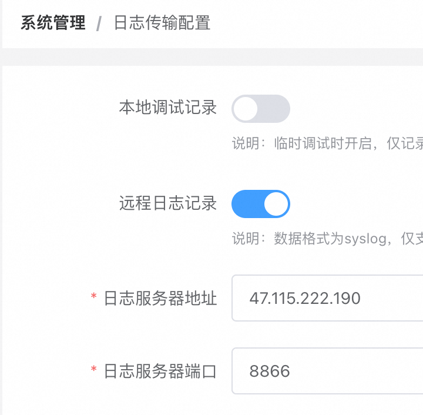
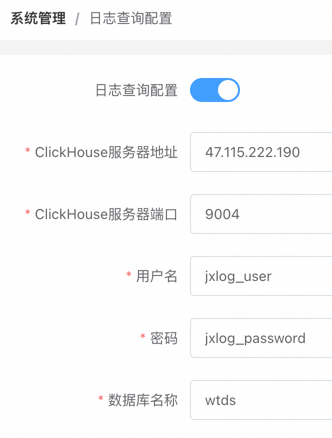

# WebTDS

[中文版](https://github.com/jx-sec/webtds/blob/master/README.md)
[English](https://github.com/jx-sec/webtds/blob/master/English.md)

## 介绍


WebTDS​（Web Threat Detection System）是一款专为Web安全检测场景开发的实时大数据分析系统，基于自研的实时大数据分析引擎，能够以极低的延迟（毫秒级）进行数据实时分析。相比通用流处理系统（如Flink/Storm），WebTDS专为Web安全检测场景进行了深度定制和优化，用户无需进行代码开发，通过配置检测策略即可实现复杂的安全检测逻辑。

🌟  高性能低成本 | 可视化配置 | 实体行为分析 | 在线学习  

## 产品亮点

### 高性能低成本

- 高性能：单节点日处理量超10亿条数据，支持横向扩展至千亿级规模，轻松应对高并发流量场景。

- 计算成本低：通过自研高性能分析引擎，相比Flink，计算费用降低90%以上。

- 运维成本低：无外部依赖（如Hadoop/ZooKeeper），开箱即用。

### 可视化配置

- ​零代码规则设计：通过图形化控制台配置检测策略（正则匹配、名单匹配、内存计算、关联分析等）。

- ​实时热更新：策略修改秒级生效，可在不影响线上业务的情况下验证策略效果。

- ​全流程闭环：从策略设计、测试到上线，全流程可视化闭环。

### 实体行为分析

- ​多维实体识别：基于用户、IP、设备，接口等实体，可以动态组合，满足复杂业务场景的需求。

- ​异常行为分析：通过分析实体行为（如访问频率、操作时序，异常动作，异常设备等），构建动态检测策略，识别符合检测策略的异常行为。例如：人工渗透测试，爬虫行为，API滥用等
  
### 在线学习

在线学习（Online Learning） 是一种机器学习方法，其核心特点是模型能够逐步更新 ，而不是一次性使用所有数据进行训练。在线学习算法会随着新数据的到来，实时调整模型参数，从而适应新数据的变化。

WebTDS支持通过在线学习训练专属安全模型 , 可用于复杂安全场景的深度检测 , 突破传统经验驱动检测能力的局限性，赋予系统数据驱动的检测能力。典型应用场景如下: 

- 内部账号被盗检测

- 内鬼员工数据盗取检测

- APT攻击检测

| **特征**       | **WebTDS在线学习**                          | **传统批量学习**                     |  
|-------------------|--------------------------------------------|------------------------------------|  
| **数据时效性**     | 实时数据                       | 全量历史数据           |  
| **模型更新**       | 实时                   | 周期性（如天/周级别）              |  
| **计算资源**       | 低硬件需求，可在普通服务器或边缘设备运行，适合流式场景                    | 依赖高性能计算资源(计算集群)，批量计算             |  
| **适用场景**       | 实时风控、内部威胁检测、强对抗场景检测         | 周期性检测、事后分析          |  

## 文档

[WebTDS产品文档](https://docs.jxwaf.com/webtds/Product-Introduction.html)

## 功能

- 线上环境
  - 基础组件
  - 名单匹配
  - 规则匹配
  - 分析组件
  - 检测策略
- 运营中心
  - 事件运营
  - 行为轨迹
  - 日志查询
  - 节点状态
- 配置管理
  - 基础组件配置
  - 名单匹配配置
  - 规则匹配配置
  - 分析组件配置
  - 检测策略配置
  - 全局字典配置
  - 策略告警配置
  - 处置接口配置
  - 处置组件配置
- 系统管理
  - 基础信息
  - 控制台配置
  - 日志传输配置
  - 日志查询配置

## 架构

- WebTDS 系统由三个子系统组成
  - WebTDS 控制台    
  - WebTDS 节点
  - WebTDS 日志系统

<kbd></kbd>


## 部署

### 环境要求

- 服务器系统 Debian 12.x

- 服务器最低配置 4 核 8G 

### WebTDS控制台账号注册

访问 https://webtds.jxwaf.com 进行账号注册

<kbd></kbd>

账号需要使用动态口令进行二次验证，可以在微信上使用小程序  **腾讯身份验证器** 扫描页面上的二维码获取动态口令

完成注册并登录控制台后，点击 系统管理 -> 基础信息 页面，查看 wtds_auth，后续节点配置需要 

<kbd></kbd>

### WebTDS节点部署

```
# 1. 安装Docker
curl -fsSL https://get.docker.com | bash -s docker --mirror Aliyun
# 2. 克隆仓库（国内可以换成 https://gitclone.com/github.com/jx-sec/jxwaf.git）
git clone https://github.com/jx-sec/webtds.git
# 3. 启动容器
cd webtds/webtds_node
vim docker-compose.yml
```

修改文件中的 WTDS_AUTH , WTDS_AUTH 为 系统管理 -> 基础信息 中 wtds_auth 的值

<kbd></kbd>


```
docker compose  up -d
```

启动后，可以在 运营中心 -> 节点状态 查看节点是否上线

<kbd></kbd>


### WebTDS日志服务部署

```
# 1. 安装Docker
curl -fsSL https://get.docker.com | bash -s docker --mirror Aliyun
# 2. 克隆仓库（国内可以换成 https://gitclone.com/github.com/jx-sec/jxwaf.git）
git clone https://github.com/jx-sec/webtds.git
# 3. 启动容器
cd webtds/webtds_jxlog
docker compose  up -d
```
部署完成后，在控制台中 系统配置 -> 日志传输配置 完成如下配置

<kbd></kbd>

在 控制台 系统配置 -> 日志查询配置 完成如下配置，其中 ClickHouse 数据库的帐号密码可以在 docker-compose.yml 文件中修改

<kbd></kbd>

### 效果验证

#### 环境说明

JXWAF节点

外网地址: 47.120.34.247

内网地址: 172.29.198.240

WebTDS节点  

外网地址:  47.120.67.55

内网地址:  172.29.198.242

#### 开启WebTDS检测

在JXWAF控制台 系统管理 -> WebTDS检测配置 ，参考如下进行配置 

<kbd></kbd>

#### 配置WebTDS检测策略 
 


## 贡献者

- [chenjc](https://github.com/jx-sec)
- [jiongrizi](https://github.com/jiongrizi)

## BUG&需求

- 微信 574604532 添加请备注 jxwaf

